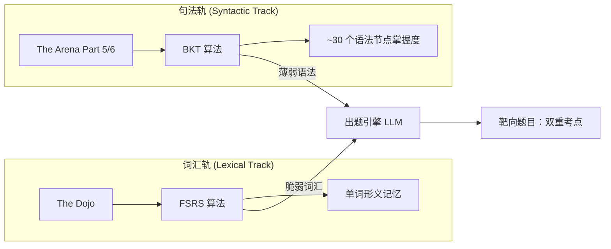

# 📄 Opus v3.0 特性 PRD：智能语法诊断树 (Grammar Skill Tree)

> **版本**: 1.0
> **状态**: 🟡 设计中
> **所属模块**: The Arena (实战演练舱)
> **核心目标**: 将 Opus 从"基于词汇的记忆工具"升级为"具备知识追踪能力的智能私教"，实现"测-评-练-讲"的系统级闭环。

---

## 一、 背景与痛点分析 (Problem Statement)

在引入本特性前，Opus 的 Arena 模块存在以下断层：

| # | 断层 | 现状 | 期望 |
|---|------|------|------|
| 1 | **用户"黑盒"困境** | 做错题后只能看单题解析，无法建立宏观认知（"我到底是不会这个词，还是不懂虚拟语气？"） | 可视化技能树，一眼看到薄弱点 |
| 2 | **调度"盲目性"** | 出题引擎按 `QuestionType` 加权选题（参照现有 `diagnostic-service.ts`），但无法区分同一 `GRAMMAR` 类下哪个具体语法点薄弱 | 精确到 L3 叶子节点的靶向出题 |
| 3 | **算法错位** | FSRS 擅长单词记忆，但处理不了四选一的"蒙对率"和"粗心失误"，导致 Arena 数据失真 | 专属 BKT 算法，有效过滤猜测噪声 |

### 解决方案

为 The Arena 引入专属 **L1-L3 TOEIC 语法结构树**，并采用 **BKT (贝叶斯知识追踪)** 算法计算熟练度，实现精准靶向出题与诊断展示。

---

## 二、 核心架构设计 (Core Architecture)

Opus v3.0 实行严格的 **双轨制 (Dual-Track)** 底层引擎：



| 轨道 | 承载模块 | 算法 | 追踪对象 |
|------|----------|------|----------|
| **词汇轨 (Lexical)** | The Dojo | FSRS | 单词的形义记忆 |
| **句法轨 (Syntactic)** | The Arena (Part 5/6) | BKT | ~30 个核心语法节点的掌握度 |

**联动机制**：出题引擎同时获取 FSRS 的"脆弱词汇"与 BKT 的"薄弱语法"，生成包含双重考点的靶向题目。

---

## 三、 TOEIC 语法拓扑图 (Grammar Taxonomy)

### 3.1 层级设计

采用 **L1-L2-L3** 三级有向无环图 (DAG) 结构，剔除 TOEIC 不考的冷门语法：

| L1 (根节点) | L2 (子节点) | L3 (叶子节点 / 考点) |
|-------------|-------------|---------------------|
| **词性 (POS)** | 名词 | 可数/不可数名词、复合名词 |
| | 形容词/副词 | 形容词 vs 副词辨析、比较级/最高级 |
| | 词性派生 | 后缀变形 (-tion, -ment, -ive, -ly) |
| **动词体系 (Verbs)** | 时态 | 现在完成时、过去完成时、将来时 |
| | 语态 | 被动语态、使役动词 |
| | 非谓语动词 | 动名词 (Gerund)、现在分词、过去分词、不定式 |
| | 主谓一致 | 主谓一致规则 |
| **从句体系 (Clauses)** | 定语从句 | 关系代词 (who/which/that)、介词+关系代词 |
| | 名词性从句 | That 从句、Whether 从句 |
| | 状语从句 | 时间/条件/让步/因果从句 |
| **句法结构 (Syntax)** | 连接词 | 并列连词、从属连词、连接副词 |
| | 介词 | 固定介词搭配 |
| | 特殊句式 | 倒装、平行结构、强调句 |

> [!IMPORTANT]
> L3 节点是算法追踪的**最小粒度**。初始阶段预计约 **30-40 个** L3 叶子节点。

### 3.2 节点编码规范

格式: `{L1}_{L2}_{L3}`，全大写蛇形命名。

| 示例 | 含义 |
|------|------|
| `VERB_TENSE_PERFECT` | 动词体系 > 时态 > 完成时 |
| `CLAUSE_RELATIVE_PRONOUN` | 从句体系 > 定语从句 > 关系代词 |
| `POS_DERIVATION_SUFFIX` | 词性 > 词性派生 > 后缀变形 |
| `SYNTAX_CONJUNCTION_SUBORDINATE` | 句法结构 > 连接词 > 从属连词 |

---

## 四、 功能模块详细说明 (Feature Specifications)

### 4.1 数据底层 (Prisma Schema)

系统需新增/修改 3 个实体：

#### 4.1.1 `GrammarNode` — 静态语法树配置

```prisma
model GrammarNode {
  id          String   @id @default(cuid())
  code        String   @unique // "VERB_TENSE_PERFECT"
  name        String              // "现在完成时"
  nameEn      String?             // "Present Perfect Tense"
  parentId    String?
  level       Int                 // 1, 2, 3
  description String?  @db.Text   // 给 LLM 看的判定规则

  parent      GrammarNode?  @relation("NodeHierarchy", fields: [parentId], references: [id])
  children    GrammarNode[] @relation("NodeHierarchy")
  questions   QuestionSeed[]
  proficiencies UserGrammarProficiency[]

  @@index([level])
  @@index([parentId])
}
```

#### 4.1.2 `QuestionSeed` — 新增外键

```prisma
model QuestionSeed {
  // ... 现有字段不变
  grammarNodeId String?       // 【新增】关联到 L3 叶子节点
  grammarNode   GrammarNode?  @relation(fields: [grammarNodeId], references: [id])

  @@index([grammarNodeId])  // 【新增】
}
```

#### 4.1.3 `UserGrammarProficiency` — 动态追踪表

```prisma
model UserGrammarProficiency {
  id            String   @id @default(cuid())
  userId        String
  grammarNodeId String

  // BKT 核心状态
  masteryScore  Float    @default(0.5) // P(L) 掌握概率 0.0~1.0
  exposureCount Int      @default(0)   // 总曝光次数
  correctCount  Int      @default(0)   // 正确次数

  updatedAt     DateTime @updatedAt

  user          User     @relation(fields: [userId], references: [id], onDelete: Cascade)
  grammarNode   GrammarNode @relation(fields: [grammarNodeId], references: [id])

  @@unique([userId, grammarNodeId])
  @@index([userId, masteryScore]) // 薄弱点快速查询
}
```

> [!NOTE]
> `User` 模型需同步添加 `grammarProficiencies UserGrammarProficiency[]` 反向关联。

---

### 4.2 后端引擎层：BKT 算法 (The BKT Engine)

**文件**: `lib/algorithm/bkt.ts`

BKT (Bayesian Knowledge Tracing) 专为四选一题型设计，天然抗猜测噪声。

#### 4.2.1 核心参数

| 参数 | 符号 | 值 | 说明 |
|------|------|-----|------|
| 蒙对率 | P(G) | 0.25 | 四选一随机概率 |
| 失误率 | P(S) | 0.05 ~ 0.15 | 根据 `difficulty` 动态调整 |
| 学习转移率 | P(T) | 0.1 | 单次练习从"未掌握"到"掌握"的概率 |
| 初始掌握度 | P(L₀) | 0.5 | 冷启动先验 |

#### 4.2.2 更新公式

当用户对 L3 节点的题目作答后：

**Step 1: 后验更新 (Posterior Update)**

```
如果答对:
  P(L|correct) = P(L) * (1 - P(S)) / [P(L) * (1 - P(S)) + (1 - P(L)) * P(G)]

如果答错:
  P(L|wrong) = P(L) * P(S) / [P(L) * P(S) + (1 - P(L)) * (1 - P(G))]
```

**Step 2: 学习转移 (Learning Transition)**

```
P(L_new) = P(L|evidence) + (1 - P(L|evidence)) * P(T)
```

#### 4.2.3 触发时机

嵌入现有的 `recordArenaOutcome` Server Action（`actions/arena-telemetry.ts`）：

```
用户提交答案 → 插入 AttemptRecord → 检查 grammarNodeId
  ├── grammarNodeId 为空 → 跳过（纯词汇题）
  └── grammarNodeId 存在 → 异步调用 updateGrammarMastery()
        ├── 1. 对 L3 节点执行 BKT 更新
        └── 2. 向上穿透：重算 L2/L1 父节点加权平均值
```

#### 4.2.4 向上穿透传递 (Bottom-up Propagation)

```
L2.masteryScore = AVG(所有子 L3 节点的 masteryScore)
L1.masteryScore = AVG(所有子 L2 节点的 masteryScore)
```

> [!TIP]
> 向上穿透仅在 L3 节点的 `masteryScore` 变化超过 ±0.05 时才触发，降低无意义的写操作频率。

---

### 4.3 调度层：靶向出题 (Targeted Injection)

修改现有的出题引擎逻辑。

#### 与现有 `diagnostic-service.ts` 的关系

| 维度 | 现有系统 (QuestionType 级) | 新增系统 (GrammarNode 级) |
|------|--------------------------|--------------------------|
| 粒度 | 6 种 ETS 题型 | ~30 个 L3 语法节点 |
| 算法 | 正确率反转加权 | BKT 贝叶斯追踪 |
| 职责 | 决定"用什么题型考" | 决定"考哪个语法知识点" |

两套系统**并存互补**：
1. `diagnostic-service.ts` 先选题型（如 `GRAMMAR`）。
2. 在该题型内部，再依据 `UserGrammarProficiency` 选择具体薄弱的 L3 节点对应的 `QuestionSeed`。

---

### 4.4 前端交互层：技能树看板 (Skill Tree Dashboard)

**入口**: The Arena 首屏顶部区域。

#### UI 形式

推荐采用 **L1 雷达图 + L2/L3 折叠树** 的渐进式交互：

- **首屏**: L1 维度（词性 / 动词 / 从句 / 句法）的雷达图概览。
- **下钻**: 点击雷达图某维度，展开 L2/L3 树状面板。

#### 视觉语言 (Color Coding)

| 状态 | 条件 | 颜色 | 标识 |
|------|------|------|------|
| **Mastered** | `masteryScore >= 0.85` | 翠绿/金色 | ✓ 高亮 |
| **Learning** | `0.4 <= masteryScore < 0.85` | 浅灰/淡蓝 | — |
| **Vulnerable** | `masteryScore < 0.4` | 橙色/柔红 | ⚠️ |

#### 交互

点击薄弱节点 → 弹出简短语法说明（50 字）+「针对性强化 5 题」按钮。

> [!CAUTION]
> **严禁**展示具体的"你还有 XX 个语法点没掌握"类计数器。遵循 Anti-Spec §4（Review Hell 禁令）。信息密度必须克制，只展示**趋势**而非**数字**。

---

### 4.5 体验干预层：Magic Wand 微课 (JIT Tutoring)

#### 触发条件

当同时满足以下两个条件时触发微课模式：
1. 用户**答错**一道题。
2. 该题对应的 L3 节点 `masteryScore < 0.3`。

#### UI 变化

原有 50 字的 `Magic Wand` 解析面板 → 自动升级为 `Magic Wand: Mini-Lesson`。

#### LLM 生成内容

| Section | 内容 | 字数 |
|---------|------|------|
| 1 | 单题错因剖析 | ~40 字 |
| 2 | 语法点全局梳理（引用 `GrammarNode.description`） | ~80 字 |
| 3 | 2 个极简例句 | ~30 字 |

---

## 五、 数据流与埋点 (Data Flow & Telemetry)

| 用户行为 | 触发 Action | 关联数据表 | 后续链路 |
|----------|------------|-----------|----------|
| 在 Arena 答题 | `recordArenaOutcome()` | `AttemptRecord` | 日志记录 |
| 答对/答错 | `updateGrammarMastery()` | `UserGrammarProficiency` | BKT 更新 → 穿透传递 |
| 进入 Arena 大厅 | `fetchUserSkillTree()` | `UserGrammarProficiency` | 渲染雷达图 |
| 点击"开始刷题" | `generateArenaSession()` | `QuestionSeed` | 薄弱点捞种子 → LLM 出题 |
| 做错 + 低掌握度 | Magic Wand 升级 | `GrammarNode` | 触发微课 Prompt |

---

## 六、 与现有系统的关联 (System Integration)

| 本 PRD 概念 | 现有实现 | 参考文档 |
|-------------|----------|----------|
| 答题遥测 | `actions/arena-telemetry.ts` | `docs/dev-notes/adaptive-diagnostic-engine.md` |
| 加权选题 | `lib/services/diagnostic-service.ts` | 同上 |
| 降维打击 | `checkAndTriggerIntervention()` | `actions/arena-telemetry.ts` L59-130 |
| Magic Wand | 现有解析面板 | `docs/PRD-L2-WEAVER-WAND.md` |
| FSRS 轨道 | Multi-Track FSRS | `docs/PRDV2.md` §3 |

---

## 七、 阶段排期与验收标准 (Roadmap)

### Phase 1: 数据底座与冷启动 (Week 1)

| Task | 交付物 | 验收标准 |
|------|--------|----------|
| 更新 Prisma Schema | `schema.prisma` 新增 3 个实体 | Migration 成功，Prisma Studio 可见 |
| 写入 GrammarNode 字典 | `scripts/seed-grammar-nodes.ts` | ~30 个 L3 节点入库 |
| 批量打标 QuestionSeed | LLM 辅助脚本 | 非词汇题 `grammarNodeId` 覆盖率 ≥ 95% |

### Phase 2: 核心引擎 (Week 2)

| Task | 交付物 | 验收标准 |
|------|--------|----------|
| BKT 纯函数 | `lib/algorithm/bkt.ts` | 单元测试通过 |
| 遥测集成 | 修改 `arena-telemetry.ts` | 答错后 DB 中 masteryScore 变化可观测 |
| 靶向抽取 | 修改出题 Action | 连续错某考点 → 下次集中出该考点题 |

### Phase 3: 前端闭环 (Week 3)

| Task | 交付物 | 验收标准 |
|------|--------|----------|
| 技能树雷达图 | Arena 大厅组件 | 移动端适配，颜色随答题实时变化 |
| Magic Wand 微课 | Mini-Lesson 模式 | 低掌握度 + 答错时自动触发 |

---

## 八、 工程约束 (Engineering Constraints)

> [!WARNING]
> 以下规则继承自 `SYSTEM_PROMPT.md`，不可违反。

1. **前端是哑终端**: 前端永远不决定难度，只渲染后端返回的数据。
2. **Anti-Spec 合规**: 技能树面板**禁止**出现排行榜、连胜计数、倒计时等焦虑触发元素。
3. **Mobile-first**: 所有交互组件必须在 `max-w-md` 下完美适配。
4. **LLM 超时兜底**: 微课生成超时时，降级为现有的 50 字单题解析。
5. **Zod 强校验**: 所有 BKT 算法输入输出必须经过 Zod Schema 校验。
