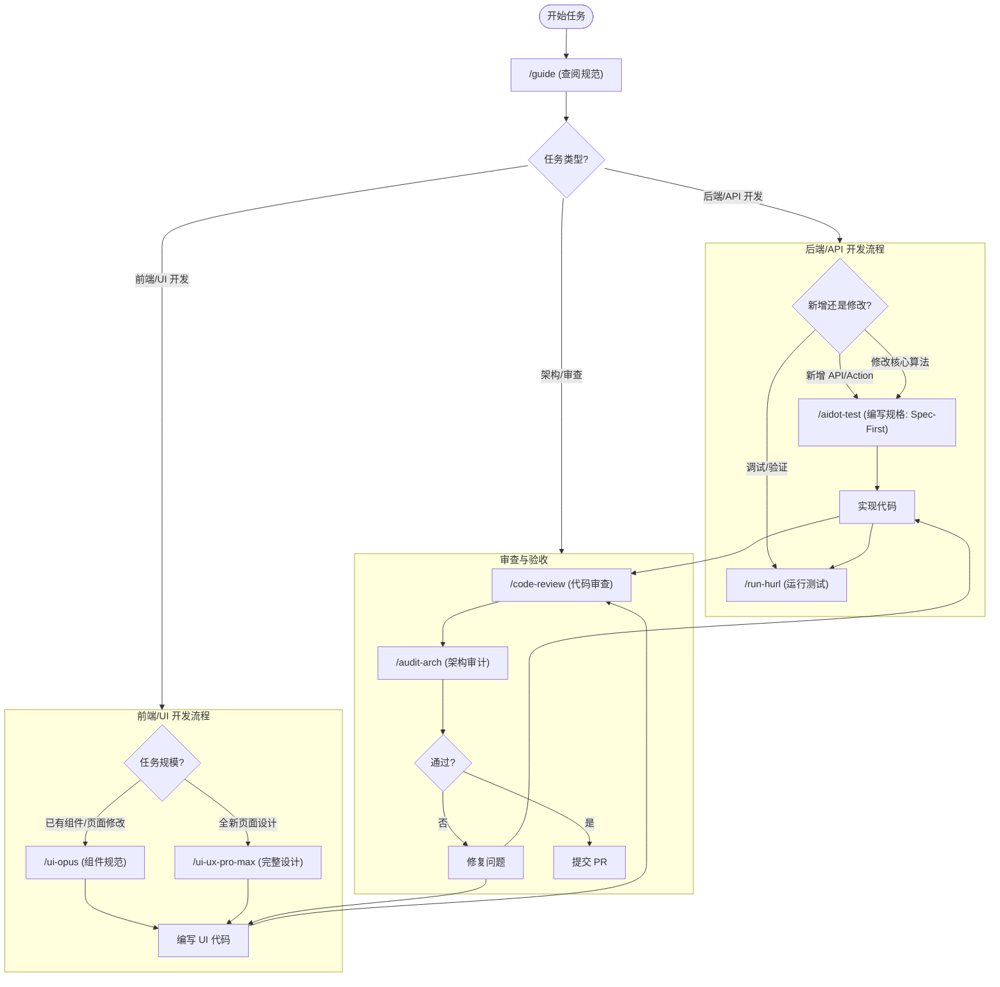

# Opus 工作流使用指南 (Workflow Usage Guide)

本文档旨在帮助开发者快速选择合适的 `.agent/workflows` 工作流，以提高开发效率并确保代码符合 Opus 的架构规范。

## 📋 工作流速查表

| 工作流 | 触发场景 | 核心用途 |
|--------|----------|----------|
| **`/guide`** | **开始任何任务之前** | 查阅项目文档索引，找到正确的规范和规则。相当于“导航员”。 |
| **`/aidot-test`** | **新增功能、修改核心逻辑时** | 遵循 "Spec-First" 原则，先写测试规格再写实现代码。支持 Hurl (API)、Vitest (Action) 和 Eval (Prompt) 场景。 |
| **`/run-hurl`** | **PR 验证、回归测试、调试端点时** | 执行已有的 Hurl API 测试。支持 L1 (防御层)、L2 (逻辑层) 和 L3 (复杂流) 测试。 |
| **`/audit-arch`** | **代码提交前、架构决策时** | 全局架构审计。自动识别领域（UI/DB/API/AI），确保全链路符合 AI-Native 标准及“宪法”要求。 |
| **`/code-review`** | **代码变更后** | 深度代码审查。不仅看代码是否工作，更看是否健壮、安全且符合业务逻辑（如 FSRS 数据完整性）。 |
| **`/ui-opus`** | **构建 UI 组件时** | 快速获取 Opus 专用的视觉（Tailwind, Colors）和业务逻辑（Schema）规范。 |
| **`/ui-ux-pro-max`** | **设计/构建全新 UI 页面时** | 完整的 UI/UX 设计工作流。包含样式检索、配色方案、排版建议及组件实现指南。 |

---

## 🔄 开发流程决策图

---

## 🎯 常见场景 FAQ

### Q1: 我刚加入项目，不知道从哪开始？
**A:** 请直接运行 **`/guide`**。它会告诉你关于项目结构、文档位置和核心规则的一切。

### Q2: 我需要写一个新的 API 端点，流程是什么？
**A:**
1.  运行 **`/aidot-test`**，选择 **场景 A (Route Handler)**。
2.  按照提示编写 `.hurl` 测试文件（定义输入输出）。
3.  编写 `route.ts` 实现代码。
4.  运行 **`/run-hurl`** 验证你的实现。

### Q3: 为什么要区分 `/ui-opus` 和 `/ui-ux-pro-max`？
**A:**
*   **`/ui-opus`** 是针对项目内 **现有设计系统 (Design System)** 的快速查阅工具，适合“依样画葫芦”。
*   **`/ui-ux-pro-max`** 是一个 **创造性工具**，当你需要从头设计一个由美学驱动的新页面（如 Landing Page、Dashboard）时使用，它会提供配色、排版等灵感。

### Q4: 我修改了 FSRS 算法，怎么保证没改坏？
**A:**
1.  运行 **`/aidot-test`**，参考 **场景 C (FSRS 算法)** 编写单元测试。
2.  确保断言覆盖了状态流转（如 `Learning` -> `Review`）和记忆稳定性变化。
3.  运行测试并通过 **`/code-review`** 检查逻辑漏洞。

### Q5: 代码跑通了，可以直接提交吗？
**A:** 不建议。请先运行 **`/audit-arch`**。它是系统级的“安检扫描仪”，能发现你可能忽略的深层架构违规（如 Next.js Server Action 泄露、数据库事务缺失等）。
