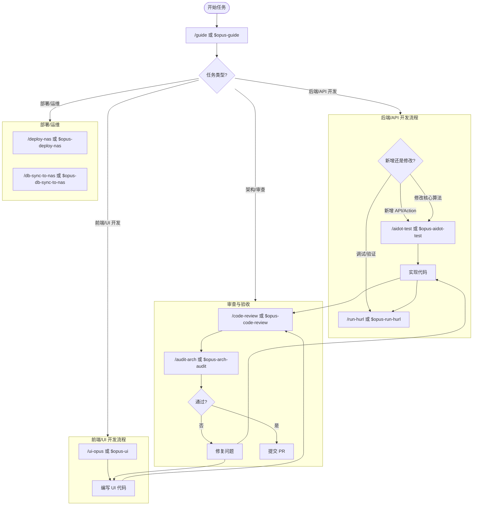

# Opus 工作流与 Skill 使用指南

本文档帮助开发者在 Antigravity 和 Codex 中选择一致的 OPUS agent 入口。Antigravity 继续使用 `.agent/workflows` 下的 slash workflow；Codex 通过官方扫描路径 `.agents/skills` 发现 `$opus-*` skill；该路径指向 `.agent/skills`，避免维护两份内容。

## 入口速查表

| 场景 | Antigravity | Codex | 核心用途 |
|------|-------------|-------|----------|
| 开始任务 / 查文档 | `/guide` | `$opus-guide` | 查阅项目文档索引，找到正确规范和规则。 |
| 新增功能 / 修改核心逻辑 | `/aidot-test` | `$opus-aidot-test` | Spec-First 测试规格，覆盖 Hurl、Vitest、Eval。 |
| 运行 Hurl 测试 | `/run-hurl` | `$opus-run-hurl` | 执行已有 Hurl API 测试。 |
| 架构审计 | `/audit-arch` | `$opus-arch-audit` | 按 OPUS 宪法检查 UI/API/AI/DB 全链路。 |
| 代码审查 | `/code-review` | `$opus-code-review` | 深度审查逻辑健壮性、架构对齐和 FSRS 完整性。 |
| UI 组件 / 页面修改 | `/ui-opus` | `$opus-ui` | 使用 OPUS 现有 UI 规范和业务约束。 |
| NAS 部署 | `/deploy-nas` | `$opus-deploy-nas` | 读取 NAS 部署流程；Codex 执行部署前必须确认用户意图。 |
| DB 同步到 NAS | `/db-sync-to-nas` | `$opus-db-sync-to-nas` | 读取数据库同步流程；Codex 执行生产同步前必须确认用户意图。 |

> Deprecated: `/ui-ux-pro-max` 已废弃，不再作为 active workflow 或 Codex skill 使用。新 UI 工作统一使用 `/ui-opus` 或 `$opus-ui`。

## 开发流程决策图

```mermaid
graph TD
    Start([开始任务]) --> Guide["/guide 或 $opus-guide"]
    Guide --> Decision{任务类型?}

    Decision -->|后端/API 开发| Backend
    Decision -->|前端/UI 开发| Frontend
    Decision -->|架构/审查| Review
    Decision -->|部署/运维| Ops

    subgraph Backend [后端/API 开发流程]
        B1{新增还是修改?}
        B1 -->|新增 API/Action| SpecFirst["/aidot-test 或 $opus-aidot-test"]
        B1 -->|修改核心算法| SpecFirst
        SpecFirst --> Implement[实现代码]
        B1 -->|调试/验证| Test["/run-hurl 或 $opus-run-hurl"]
        Implement --> Test
    end

    subgraph Frontend [前端/UI 开发流程]
        UI["/ui-opus 或 $opus-ui"] --> Coding[编写 UI 代码]
    end

    subgraph Review [审查与验收]
        Coding --> CodeReview["/code-review 或 $opus-code-review"]
        Implement --> CodeReview
        CodeReview --> Audit["/audit-arch 或 $opus-arch-audit"]
        Audit --> Pass{通过?}
        Pass -->|否| Fix[修复问题]
        Fix --> Coding
        Fix --> Implement
        Pass -->|是| PR[提交 PR]
    end

    subgraph Ops [部署/运维]
        Deploy["/deploy-nas 或 $opus-deploy-nas"]
        Sync["/db-sync-to-nas 或 $opus-db-sync-to-nas"]
    end
```

## 常见场景

### Q1: 我刚加入项目，不知道从哪开始？
运行 `/guide` 或 `$opus-guide`。它会根据任务域引导你阅读正确的 PRD、架构文档、测试协议和实现真相源。

### Q2: 我需要写一个新的 API 端点，流程是什么？
先运行 `/aidot-test` 或 `$opus-aidot-test`，为 Route Handler 创建 `.hurl` 规格文件；实现后运行 `/run-hurl` 或 `$opus-run-hurl` 验证。

### Q3: 我需要做 UI，该用哪个入口？
统一使用 `/ui-opus` 或 `$opus-ui`。`/ui-ux-pro-max` 已废弃，不再用于新页面设计或实现。

### Q4: 我修改了 FSRS 算法，怎么保证没改坏？
运行 `/aidot-test` 或 `$opus-aidot-test`，参考 FSRS 场景编写单元测试，断言状态流转、复习时间和稳定性变化；再用 `/code-review` 或 `$opus-code-review` 检查逻辑漏洞。

### Q5: 代码跑通了，可以直接提交吗？
不建议。先运行 `/code-review` 或 `$opus-code-review`，再运行 `/audit-arch` 或 `$opus-arch-audit` 做系统级检查。

### Q6: Codex 会自动执行部署或数据库同步吗？
不会。`$opus-deploy-nas` 和 `$opus-db-sync-to-nas` 是 bridge skills；Codex 必须先读取对应 workflow，并且在执行生产部署、生产同步或 `--overwrite-danger` 前确认用户明确意图。
