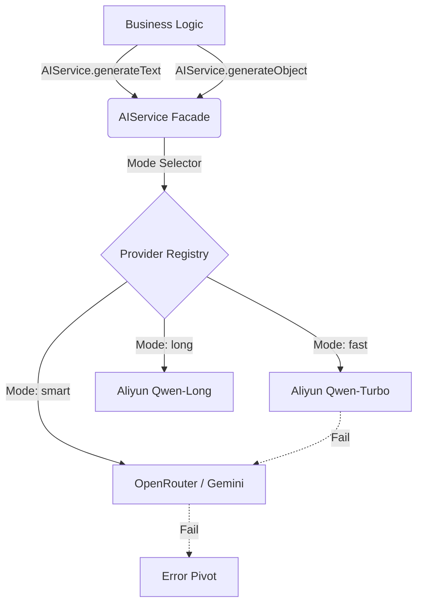

# Unified AI Service Architecture (V3.0)

## 1. 核心理念 (Core Philosophy)

为了解决 LLM 调用逻辑分散、Failover 机制不统一的问题，Opus 引入了 **Unified AI Service (`lib/ai/core.ts`)**。

### 关键原则
- **Unified Facade**: 业务代码 **禁止** 直接调用 `ai` SDK 或 `fetch` API。必须通过 `AIService` 单例进行交互。
- **Fail-Safe**: 所有 AI 调用默认具备自动重试 (`Retry`) 和 多厂商切换 (`Failover`) 能力。
- **Strategy Pattern**: 通过 `mode` 参数自动选择最佳模型，业务层无需关心底层 Provider (Aliyun/OpenRouter/Gemini)。

---

## 2. 架构设计 (Architecture)



### 2.1 模式 (Modes)
| Mode | 用途 | 优先级配置 (Env Order) | 特性 |
| :--- | :--- | :--- | :--- |
| `fast` | **前台业务** (Drills/Chat/Article) | `AI_FAST_ORDER` (默认: aliyun, openrouter) | 速度优先 |
| `smart` | **后台业务** (ETL/Audit/Eval) | `AI_SMART_ORDER` (默认: openrouter, aliyun) | 智力/逻辑优先 |

### 2.2 目录结构
- `lib/ai/core.ts`: **唯一的公开入口** (Facade)。
- `lib/ai/providers.ts`: **私有实现**。负责厂商注册、API Key 管理、Proxy 配置。
- `lib/ai/client.ts`: [Deprecated] 旧版客户端，仅供 `scripts/` 离线脚本使用。
- `actions/`, `workers/`: 业务层，只引用 `lib/ai/core.ts`。

---

## 3. 使用指南 (Usage Guide)

### 3.1 文本生成 (Text Generation)
```typescript
import { AIService } from '@/lib/ai/core';

const { text, provider } = await AIService.generateText({
    mode: 'fast', // or 'smart'
    system: "You are a helpful assistant.",
    prompt: "Hello world",
    temperature: 0.7, // Optional
});
```

### 3.2 结构化生成 (Structured Output) -> **推荐**
```typescript
import { AIService } from '@/lib/ai/core';
import { z } from 'zod';

const MySchema = z.object({
    sentiment: z.enum(['positive', 'negative']),
    score: z.number()
});

const { object, provider } = await AIService.generateObject({
    mode: 'smart',
    schema: MySchema,
    prompt: "Analyze this text...",
    // temperature is supported for ETL tasks needing consistency
    temperature: 0.1, 
});

// result.object is strictly typed as { sentiment: '...', score: ... }
```

---

## 4. 最佳实践 (Best Practices)

1.  **ETL 任务**: 务必使用 `mode: 'smart'` + `temperature: 0.1` 以获得最稳定的结构化输出。
2.  **User Drill**: 使用 `mode: 'fast'` 确保用户端 Zero-Wait 体验。
3.  **错误处理**: `AIService` 会自动重试并切换 Provider。如果所有 Provider 都失败，会抛出 Error。业务层应在 Server Action 中捕获该 Error 并返回友好的 UI 提示（或降级到规则生成）。
4.  **日志**: `AIService` 自动记录 `provider`, `usage` (tokens), `latency`。无需业务层重复打点，除非需要记录业务上下文。

## 5. 迁移指南 (Migration)
如果你发现旧代码：
```typescript
import { generateText } from 'ai';
import { getAIModel } from '@/lib/ai/client'; // STOP!
```

请立即重构为：
```typescript
import { AIService } from '@/lib/ai/core';
// ... AIService.generateText(...)
```
