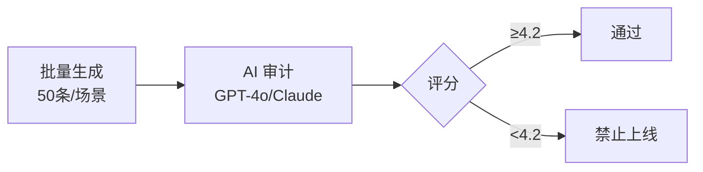

# Opus Evaluation Matrix (评估矩阵)

> 文档版本：v1.0
> 最后更新：2026-01-31
> 状态：Draft

## 0. 核心挑战

Opus 是一个 **双重非确定性系统**：

| 非确定性来源 | 成因 | 影响 |
|--------------|------|------|
| **逻辑非确定性** | FSRS 算法 → 每用户每天题目不同 | 传统 Unit Test 无法覆盖 |
| **内容非确定性** | LLM 概率生成 → 同题每次文本不同 | 无法用 Snapshot Test 回归 |

**解决方案**：构建三维评估矩阵 (Logic × Quality × Stability)。

---

## 1. 维度一：逻辑正确性 (Logic)

> 目标：确保调度器没有发疯，确保"该出现的出现了，不该出现的被拦住了"。

### 1.1 测试策略：Time-Travel Simulation (时间旅行模拟)

编写自动化脚本模拟虚拟用户 30 天学习历程，**不涉及真实 LLM 调用** (Mock 数据)。

### 1.2 核心测试用例

#### Case A: 多轨隔离测试 (Multi-Track Isolation)

| 项目 | 内容 |
|------|------|
| **操作** | 设置 `Strategy` 的 Visual Track = `Master` (S=100)，Audio Track = `Review` (S=1) |
| **预期** | `/next-batch` 必须返回 Audio Gym 卡片，**禁止**返回 Speed Run 卡片 |
| **测试文件** | `actions/__tests__/multi-track.test.ts` |

#### Case B: 依赖熔断测试 (Dependency Circuit Breaker)

| 项目 | 内容 |
|------|------|
| **操作** | 设置 `Strategy` 的 Visual Track = `New` (不认识) |
| **预期** | 无论 Audio Track 状态如何，**禁止**返回 L1/L2 卡片 |
| **逻辑** | L0 未掌握 → 自动熔断高级场景 |

#### Case C: 混合流比例测试 (Interleaving Ratio)

| 项目 | 内容 |
|------|------|
| **操作** | 构造 100 个待复习单词 (20个 L0, 50个 L1, 30个 L2) |
| **预期** | 前 10 张卡片中 L1 占比最高，且必须穿插出现 (禁止连续 10 张全同类型) |

### 1.3 工具链

- **测试框架**: Vitest + Mock Database
- **现有测试**: `actions/__tests__/*.test.ts`

---

## 2. 维度二：内容质量 (Quality)

> 目标：确保 LLM 没在胡说八道，干扰项是有效的，解析是人话。

### 2.1 测试策略：LLM-as-a-Judge (AI 裁判员)

建立 **Golden Evaluation Pipeline**：



### 2.2 评估流程

#### Step 1: 批量生成 (Batch Generation)

```bash
npx tsx scripts/generate-eval-samples.ts --level=0 --variant=blitz --limit=50
```

- 输入覆盖：生词、熟词、多义词、行业黑话

#### Step 2: AI 审计 (The Auditor)

使用高智商模型加载 **角色 Prompt**：

| 角色 | 评估维度 | 标准 |
|------|----------|------|
| **ETS Auditor** | 业务语境真实性 + 干扰项质量 | 拒绝 AI 味道的句子 |
| **Anxious Engineer** | 解释清晰度 + 3秒可读 | 读两遍才懂 → Fail |
| **FSRS Pedagogy Expert** | 记忆科学合规性 | 间隔重复、难度递进 |

**评分细项**:

| 检查项 | 类型 | 阈值 |
|--------|------|------|
| JSON 结构符合 Zod Schema | Pass/Fail | 100% |
| L2 句子体现商务语境 | 1-5分 | ≥3.5 |
| L0 干扰项包含 Visual Trap | Yes/No | ≥80% |
| 词性变体真实存在 (无幻觉) | Pass/Fail | 100% |

#### Step 3: 告警阈值

- 平均分从 4.8 → 4.2 = **禁止上线** (Prompt 退化)

### 2.3 工具链

- **现有脚本**: `scripts/eval-prompts.ts`
- **报告目录**: `reports/`

---

## 3. 维度三：系统稳定性 (Stability)

> 目标：确保无限流在 1000 次滑动后不会崩，TTS 不会卡。

### 3.1 测试策略：Bot User Stress Test (机器人压力测试)

编写无头浏览器或 API 脚本，模拟极端用户行为。

### 3.2 场景：The Binge Learner (刷题狂魔)

| 项目 | 内容 |
|------|------|
| **行为** | 连续请求 `/next-batch` 100 次 (相当于 1000 道题) |
| **监测** | Latency P99、Error Rate、Retry Success |

**指标阈值**:

| 指标 | 阈值 | 说明 |
|------|------|------|
| **Latency P99** | ≤2s | 否则 DB 索引或 Redis 有问题 |
| **Error Rate** | ≤1% | LLM 超时或 JSON 解析失败 |
| **Pivot Success** | 100% | 兜底逻辑必须成功救场 |

### 3.3 TTS 专项测试

- 并发请求 10 个 L1 听力题
- 检查 Python TTS 服务队列是否堆积
- 检查内存泄漏

### 3.4 工具链

- **推荐**: k6 (负载测试) 或 Playwright

---

## 4. 终极审计：上帝视角 Dashboard (The God View)

### 4.1 Admin Panel 功能需求

在 `/dashboard/admin` 增加 **Generator Inspector** 页面：

| 功能 | 描述 |
|------|------|
| **实时流** | 显示当前所有用户正在生成的题目 |
| **快照对比** | 左：Prompt 输入 / 右：LLM 输出 |
| **标注按钮** | 👍 / 👎 (Bad Case 收集) |
| **Bad Case 回流** | 👎 自动存入 Few-Shot Examples 库 |

### 4.2 Bad Case 回流机制


---

## 5. 实施清单

| 层面 | 测试对象 | 方法 | 频率 | 现状 |
|------|----------|------|------|------|
| **Logic** | FSRS 调度、混合流比例、依赖熔断 | Vitest Unit Tests (Mock) | 每次 Git Commit | ✅ 部分实现 |
| **Quality** | 题目质量、干扰项逻辑、幻觉 | AI Auditor Script | 修改 Prompt 后必跑 | ✅ 已有脚本 |
| **Stability** | 接口延迟、并发承载、Pivot 兜底 | k6 Stress Test | 上线前跑一次 | ⚠️ 缺失 |
| **Audit** | 真实用户体验、Bad Case | Admin Dashboard (人工看) | 每天抽看 5 分钟 | ⚠️ 缺失 |

---

## 6. Gap 分析与优先级

### 6.1 已完成 ✅

| 项目 | 文件 | 状态 |
|------|------|------|
| 多轨测试 | `actions/__tests__/multi-track.test.ts` | Done |
| FSRS 状态转换 | `actions/__tests__/record-outcome.test.ts` | Done |
| 无限流逻辑 | `components/session/__tests__/session-runner.test.tsx` | Done |
| LLM 评估脚本 | `scripts/eval-prompts.ts` | Done |
| 样本生成脚本 | `scripts/generate-eval-samples.ts` | Done |

### 6.2 缺失 Gap ⚠️

| 项目 | 优先级 | 建议 |
|------|--------|------|
| **依赖熔断测试** (L0 未掌握 → 禁止 L1/L2) | P0 | 新增 Unit Test |
| **混合流比例测试** (Interleaving 校验) | P1 | 新增 Unit Test |
| **k6 压力测试脚本** | P1 | 新建 `tests/load/` |
| **Admin Inspector 页面** | P2 | 新增 `/dashboard/admin/inspector` |
| **Bad Case 回流机制** | P2 | 需要 DB Schema + API |

---

## 7. 相关文档

- [LLM 评估架构](./llm-eval-architecture.md)
- [Prompt 结构 V2](./prompt-structure-v2.md)
- [测试指南](./TESTING.md)
