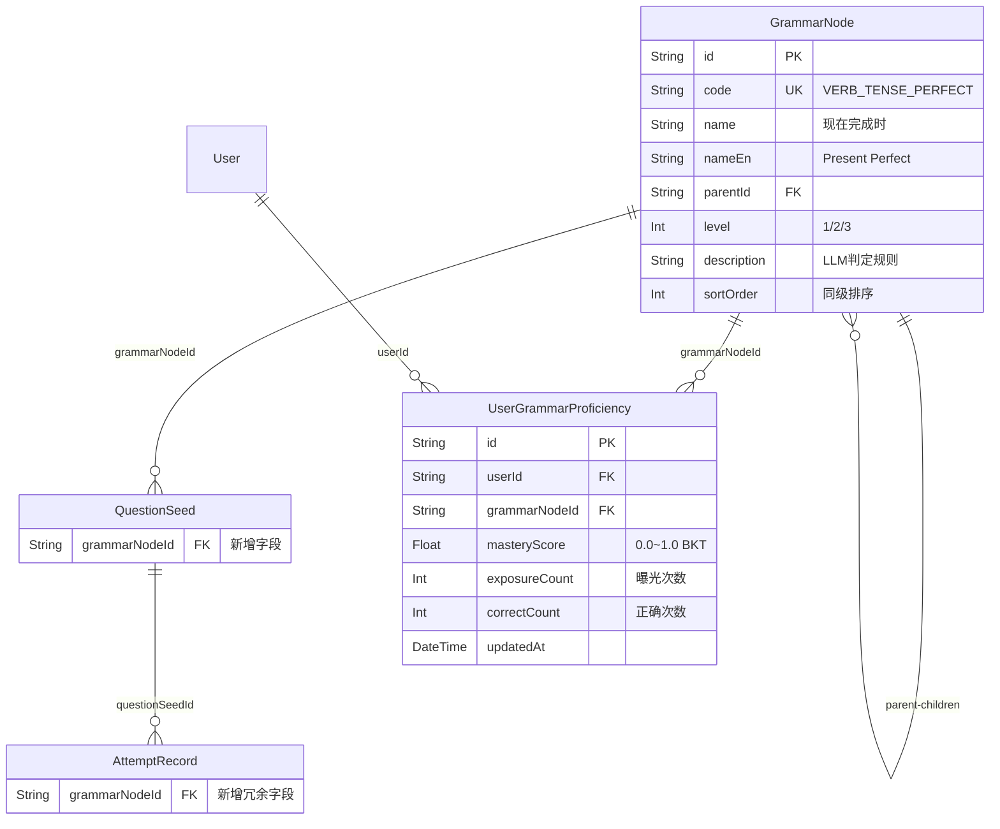

# 语法诊断树 — 数据库表设计方案

> **关联 PRD**: [PRD-GRAMMAR-SKILL-TREE.md](file:///d:/github/OPUS/docs/PRD-GRAMMAR-SKILL-TREE.md)
> **目标**: 在现有 Schema 中新增 2 张表 + 修改 2 张表，支撑语法树的 BKT 追踪与靶向出题。

---

## 一、 变更总览



---

## 二、 新增表

### 2.1 `GrammarNode` — 语法知识图谱 (静态配置)

| 字段 | 类型 | 约束 | 说明 |
|------|------|------|------|
| `id` | `String` | PK, cuid() | 主键 |
| `code` | `String` | **UNIQUE** | 节点编码，如 `VERB_TENSE_PERFECT` |
| `name` | `String` | NOT NULL | 中文名，如 `现在完成时` |
| `nameEn` | `String?` | — | 英文名，如 `Present Perfect Tense` |
| `parentId` | `String?` | FK → self | 父节点 ID（L1 根节点为 null） |
| `level` | `Int` | NOT NULL | 层级：1=根, 2=子, 3=叶子 |
| `description` | `String?` | @db.Text | 给 LLM 的语法判定规则描述 |
| `sortOrder` | `Int` | default(0) | 同级节点排序权重（前端渲染用） |

**索引设计**:

| 索引 | 字段 | 用途 |
|------|------|------|
| `@@index([level])` | level | 按层级快速筛选（如：获取所有 L3 节点） |
| `@@index([parentId])` | parentId | 树遍历：查子节点、向上穿透 |

**Prisma 定义**:

```prisma
model GrammarNode {
  id          String   @id @default(cuid())
  code        String   @unique
  name        String
  nameEn      String?
  parentId    String?
  level       Int
  description String?  @db.Text
  sortOrder   Int      @default(0)

  parent        GrammarNode?             @relation("NodeHierarchy", fields: [parentId], references: [id])
  children      GrammarNode[]            @relation("NodeHierarchy")
  questions     QuestionSeed[]
  proficiencies UserGrammarProficiency[]

  @@index([level])
  @@index([parentId])
}
```

**设计决策**:

> [!NOTE]
> **为什么用自关联而非 3 张独立表？**
> L1/L2/L3 的字段结构完全一致（code, name, description），用自关联 + `level` 字段可以一张表搞定，查询时通过 `level` 筛选即可。Prisma 对自关联的支持成熟，无额外复杂度。

> [!NOTE]
> **为什么加 `sortOrder`？**
> 前端雷达图和折叠树需要稳定的展示顺序。如果不加排序字段，同级节点的顺序取决于数据库插入顺序，不可控。

---

### 2.2 `UserGrammarProficiency` — 用户语法熟练度 (动态行为)

| 字段 | 类型 | 约束 | 说明 |
|------|------|------|------|
| `id` | `String` | PK, cuid() | 主键 |
| `userId` | `String` | FK → User | 用户 ID |
| `grammarNodeId` | `String` | FK → GrammarNode | 语法节点 ID |
| `masteryScore` | `Float` | default(0.5) | BKT 掌握概率 P(L)，范围 0.0~1.0 |
| `exposureCount` | `Int` | default(0) | 该节点总曝光次数 |
| `correctCount` | `Int` | default(0) | 做对的次数 |
| `updatedAt` | `DateTime` | @updatedAt | 最后更新时间 |

**索引设计**:

| 索引 | 字段 | 用途 |
|------|------|------|
| `@@unique([userId, grammarNodeId])` | 复合唯一 | 每个用户对每个节点只有一条记录 |
| `@@index([userId, masteryScore])` | 复合索引 | **核心热路径**：靶向出题时快速查出最薄弱的 3 个节点 |

**Prisma 定义**:

```prisma
model UserGrammarProficiency {
  id            String   @id @default(cuid())
  userId        String
  grammarNodeId String

  masteryScore  Float    @default(0.5)
  exposureCount Int      @default(0)
  correctCount  Int      @default(0)

  updatedAt     DateTime @updatedAt

  user        User        @relation(fields: [userId], references: [id], onDelete: Cascade)
  grammarNode GrammarNode @relation(fields: [grammarNodeId], references: [id], onDelete: Restrict)

  @@unique([userId, grammarNodeId])
  @@index([userId, masteryScore])
}
```

**设计决策**:

> [!IMPORTANT]
> **为什么 L2/L1 节点也写入此表？**
> 向上穿透传递后，L2/L1 的 `masteryScore` 作为加权平均值也存入此表。好处是前端渲染雷达图时只需一次 `findMany` 即可拿到所有层级的数据，无需再做实时聚合计算。

> [!NOTE]
> **`masteryScore` 初始值为什么是 0.5 而非 0？**
> BKT 的先验假设：用户对一个全新语法点有 50% 的概率已经掌握（毕竟目标用户有一定英语基础）。这比从 0 开始更符合 Anti-Spec 原则——避免用户看到一片红色的恐慌界面。

> [!WARNING]
> **明确 L1/L2 数据的"更新时序" (业务代码约束)**
> 每次用户做题后，BKT 算法**只计算和更新 L3（叶子节点）**的 masteryScore。L2 和 L1 的聚合更新不应该在同步链路（Server Action）中做，否则会拖慢答题结算的响应时间。通过后台异步任务或在需要拉取看板数据时再触发。

---

## 三、 修改现有表

### 3.1 `QuestionSeed` — 新增 `grammarNodeId` 外键

```diff
 model QuestionSeed {
   // ... 现有字段不变

+  // [V3.0] 语法树挂载
+  grammarNodeId String?
+  grammarNode   GrammarNode? @relation(fields: [grammarNodeId], references: [id], onDelete: Restrict)

   // 关联
   anchorVocab    Vocab?          @relation(fields: [anchorVocabId], references: [id])
   attemptRecords AttemptRecord[]

   // 索引
+  @@index([grammarNodeId])
   @@index([anchorVocabId])
   // ... 其余索引不变
 }
```

| 字段 | 说明 |
|------|------|
| `grammarNodeId` | 可空。纯词汇题（`SYNONYM`）为 null；语法类题（`GRAMMAR`, `MORPHOLOGY` 等）指向 L3 叶子节点 |

> [!TIP]
> **打标覆盖策略**: Phase 1 中用 LLM 辅助脚本批量打标时，只需对 `questionType IN ('GRAMMAR', 'MORPHOLOGY', 'COLLOCATION')` 的种子题执行。`SYNONYM` 类属纯词义辨析，不涉及语法结构，跳过即可。

---

### 3.2 `AttemptRecord` — 新增冗余 `grammarNodeId`

```diff
 model AttemptRecord {
   // ... 现有字段不变

+  // [V3.0] 语法树冗余 (避免 JOIN QuestionSeed 再 JOIN GrammarNode)
+  grammarNodeId String?
+  grammarNode   GrammarNode? @relation(fields: [grammarNodeId], references: [id])

   // 冗余维度
   questionType QuestionType
   part         Int

   // 索引
+  @@index([userId, grammarNodeId])
   // ... 其余索引不变
 }
```

**设计决策**:

> [!IMPORTANT]
> **为什么在 AttemptRecord 中冗余 `grammarNodeId`？**
> 与现有的 `questionType` 冗余设计一脉相承。BKT 更新时需要从 `AttemptRecord` 快速聚合"该用户在某 L3 节点的最近 N 次表现"，如果每次都 JOIN `QuestionSeed` 再取 `grammarNodeId`，在高频写入场景下性能不可接受。冗余一个字段，换来 `WHERE userId = ? AND grammarNodeId = ?` 的单表扫描。

---

### 3.3 `User` — 新增反向关联

```diff
 model User {
   // 核心资产
   progress       UserProgress[]
   articles       Article[]
   drillCaches    DrillCache[]
   attemptRecords AttemptRecord[]
+  grammarProficiencies UserGrammarProficiency[]
 }
```

---

## 四、 数据量与性能估算

| 表 | 预期行数 | 增长模式 | 备注 |
|----|---------|----------|------|
| `GrammarNode` | ~40 | 静态，几乎不增长 | 初始 Seed 后不再频繁变动 |
| `QuestionSeed` | ~3000+ | 缓慢增长 | 新增一个可空外键，无性能影响 |
| `UserGrammarProficiency` | ~40 × 用户数 | 线性增长 | 每用户最多 40 行，单用户查询极快 |
| `AttemptRecord` | 高速增长 | 每次答题 +1 | 冗余字段 + 索引确保聚合查询性能 |

---

## 五、 Migration 策略

```bash
# 1. 生成 Migration（不破坏现有数据，所有新增字段均为可空或有默认值）
npx prisma migrate dev --name add_grammar_skill_tree

# 2. 验证
npx prisma studio
```

> [!NOTE]
> 本次 Migration 为**纯增量操作**（新增表 + 新增可空字段），不修改/删除任何现有字段，不存在数据丢失风险。所有添加的外键字段均为 `String?`（可空），不强制要求现有数据满足外键约束。
