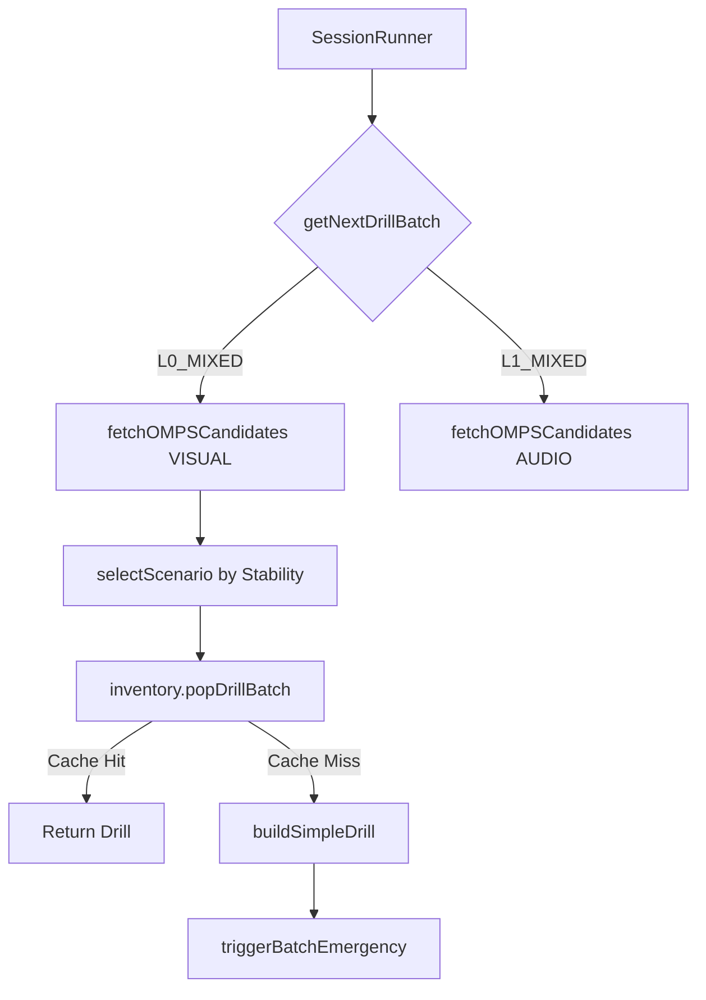

# 混合模式架构 (Mixed-Mode Architecture)

**创建日期**: 2026-02-08  
**版本**: V1.0  
**适用范围**: L0/L1/L2 混合模式训练流程

---

## 1. 概述

混合模式 (Mixed Mode) 是 Opus V3 的核心训练架构，将原本分散的单一场景 (SYNTAX, PHRASE, BLITZ 等) 统一为三个级别的智能路由模式：

| 模式 | Track | 允许场景 | 适用阶段 |
|------|-------|---------|---------|
| `L0_MIXED` | VISUAL | SYNTAX, PHRASE, BLITZ | 认知康复期 |
| `L1_MIXED` | AUDIO | AUDIO, CHUNKING | 听觉反射期 |
| `L2_MIXED` | CONTEXT | CONTEXT, NUANCE | 语境理解期 |
| `DAILY_BLITZ` | VISUAL | ALL (7 scenarios) | 日常综合训练 |

---

## 2. 核心机制

### 2.1 场景选择 (Scenario Selector)

基于 **FSRS Stability** 自动分配场景：

```
Stability < 7   → SYNTAX  (基础巩固)
Stability < 21  → PHRASE  (短语强化)
Stability < 45  → BLITZ   (快速反应)
Stability >= 45 → 随机 (全场景轮换)
```

**配置文件**: `lib/config/stability-thresholds.ts`

```typescript
export const L0_THRESHOLDS = {
    SYNTAX_MAX: 7,   // 低于此值 → SYNTAX
    PHRASE_MAX: 21,  // 低于此值 → PHRASE
    BLITZ_MAX: 45    // 低于此值 → BLITZ
} as const;
```

### 2.2 Track 隔离 (Multi-Track FSRS)

每个混合模式使用独立的 FSRS Track，避免数据污染：

| 模式 | Primary Track | 含义 |
|------|--------------|------|
| L0_MIXED | VISUAL | 视觉认知数据 |
| L1_MIXED | AUDIO | 听觉反射数据 |
| L2_MIXED | CONTEXT | 语境理解数据 |

---

## 3. 数据流



---

## 4. 关键文件

| 文件 | 作用 |
|------|------|
| `types/briefing.ts` | 定义 `SessionMode`, `SingleScenarioMode` 类型 |
| `lib/core/scenario-selector.ts` | 场景选择算法 |
| `lib/config/mixed-mode-config.ts` | 混合模式公共配置 |
| `lib/config/stability-thresholds.ts` | 阈值配置 (A/B Testing) |
| `actions/get-next-drill.ts` | Server Action 入口 |
| `lib/core/inventory.ts` | Redis 缓存管理 (`popDrillBatch`) |

---

## 5. Inventory 批量操作

为解决 N+1 查询问题，新增 `popDrillBatch` 方法：

```typescript
// 按场景分组批量获取
const scenarioGroups = { "SYNTAX": [101, 102], "PHRASE": [103] };
const drillMap = await inventory.popDrillBatch(userId, scenarioGroups);
```

**优化效果**：Redis 请求次数从 `N` 降为 `1`

---

## 6. Fail-Safe 策略

当 Inventory 为空 (Cache Miss) 时：

1. **Fallback**: 使用 `buildSimpleDrill` 生成确定性兜底内容
2. **Async Replenish**: 触发 `triggerBatchEmergency` 异步补货
3. **标记**: `drill.meta.source = 'deterministic_fallback'`

---

## 7. 测试覆盖

| 测试文件 | 覆盖范围 |
|---------|---------|
| `lib/core/__tests__/scenario-selector.test.ts` | 场景选择算法 (23 cases) |
| `actions/__tests__/mixed-mode.test.ts` | 集成测试 (6 cases) |

---

## 8. 配置化原则

1. **DRY**: 所有模式列表统一管理于 `mixed-mode-config.ts`
2. **A/B Ready**: 阈值可动态调整，无需改代码
3. **Type-Safe**: 使用 `createSessionModeRecord` 确保类型覆盖

---

**相关文档**:
- [OMPS 选词引擎](./omps-word-selection-engine.md)
- [Redis Inventory Schema](./redis-inventory-schema.md)
- [Phase 2 架构总结](./phase2-architecture-summary.md)
