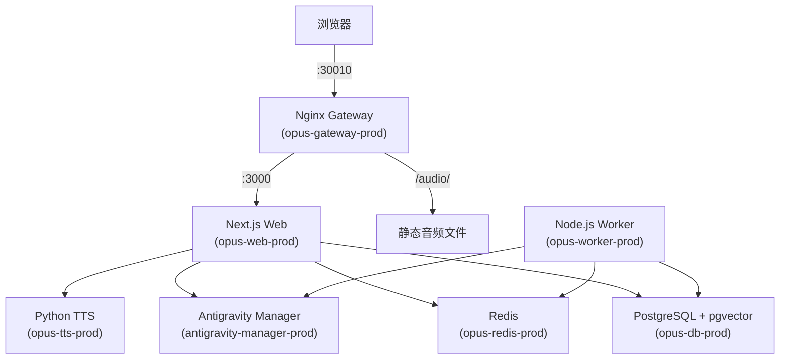

# NAS 部署指南 (Synology DSM)

> **部署目标**: Mac (ARM) → Synology NAS (AMD64)
> **部署路径**: `/volume1/docker/opus`
> **访问地址**: `http://<NAS_IP>:30010` 或自定义域名
> **最后更新**: 2026-02-23 (自动化脚本已完全修复)

---

## 🚀 一键部署 (推荐)

部署流程已被完全自动化并集成在 `build-and-export.sh` 脚本中。该脚本会自动读取 `.env` 配置，执行跨平台构建、镜像导出、SCP 传输、远程加载以及 Docker Compose 重启。

### 1. 确保 `.env` 已配置

你的本地 `.env` 文件中必须包含以下 NAS 连接信息：

```env
NAS_USER="None"
NAS_IP="192.168.5.23"
NAS_PORT="2002"
NAS_PATH="/volume1/docker/opus"
NAS_PASSWORD="你的实际密码"
```

### 2. 执行一键部署

```bash
# 构建 latest 标签并直接部署到 NAS
./build-and-export.sh latest --deploy
```

> [!NOTE]
> 脚本会自动通过 `sshpass` 和 `sudo -S` 处理群晖权限，执行全程无需人工干预。

---

## 架构总览



**7 个容器**：`gateway` / `antigravity-manager` / `opus-web` / `opus-worker` / `opus-tts` / `opus-db` / `opus-redis`

---

## 数据持久化

使用**绑定挂载**到 NAS 固定目录，便于备份管理：

```
/volume1/docker/opus/
├── data/
│   ├── postgres/          # PostgreSQL 数据
│   ├── redis/             # Redis AOF 持久化
│   ├── audio/             # TTS 音频缓存
│   ├── logs/              # 应用日志
│   └── antigravity/       # LLM API Manager 数据
├── nginx/
│   └── nginx.conf         # Nginx 配置
├── docker-compose.yml     # 运行时 Compose（从 nas.yml 复制）
└── .env                   # 环境变量
```

---

## 数据库管理 (针对新建/迁移)

### 数据表分类 (`prisma/schema.prisma`)

| 分类 | 标记 | 说明 |
|------|------|------|
| 静态题库 | `[STATIC_DATA]` | `Vocab`, `QuestionSeed`, `GrammarNode`, `Etymology`, `SmartContent`, `TTSCache` 等 |
| 用户数据 | `[USER_DATA]` | `User`, `UserProgress`, `UserVocabState`, `AttemptRecord`, `DrillCache`, `DrillAudit` 等 |

### 方案 A：整库全量覆盖 (适合全新部署)

> [!CAUTION]
> 此方案会丢弃生产环境的一切现有数据（包含用户学习进度）。

```bash
# 1. 本地全量导出 (Custom 格式)
docker exec opus-db pg_dump -U postgres -d opus -Fc -f /tmp/opus_full.dump
docker cp opus-db:/tmp/opus_full.dump ./opus_full.dump

# 2. 上传并恢复
scp -O -P 2002 opus_full.dump None@192.168.5.23:/tmp/
ssh -p 2002 None@192.168.5.23
  # 在 NAS 上执行:
  sudo /usr/local/bin/docker stop opus-web-prod opus-worker-prod
  sudo /usr/local/bin/docker cp /tmp/opus_full.dump opus-db-prod:/tmp/
  sudo /usr/local/bin/docker exec opus-db-prod bash -c 'psql -U postgres -c "SELECT pg_terminate_backend(pid) FROM pg_stat_activity WHERE datname='\''opus'\'' AND pid <> pg_backend_pid();" && dropdb -U postgres opus && createdb -U postgres opus && pg_restore -U postgres -d opus /tmp/opus_full.dump'
  sudo /usr/local/bin/docker start opus-web-prod opus-worker-prod
```

### 方案 B：仅同步更新题库 (保留用户进度)

> [!WARNING]
> **切勿使用 `--clean` 参数或导出为纯文本 SQL！**
> 纯文本 SQL 在 `definition_jp` 日文字段存在编码踩坑风险。`--clean` 会删除表结构触发外键冲突。

```bash
# 1. 本地使用 Custom 格式导出纯数据 (--data-only)
docker exec opus-db pg_dump -U postgres -d opus -Fc --data-only \
  -t '"Vocab"' -t '"Etymology"' -t '"SmartContent"' \
  -t '"TTSCache"' -t '"QuestionSeed"' -t '"GrammarNode"' \
  -t '"InvitationCode"' \
  -f /tmp/opus_static.dump
docker cp opus-db:/tmp/opus_static.dump ./opus_static.dump

# 2. 上传到 NAS
scp -O -P 2002 opus_static.dump None@192.168.5.23:/tmp/

# 3. 登入 NAS 并手动 TRUNCATE 后恢复
# (注: TRUNCATE CASCADE 会级联清空关联了静态表的用户进度数据，请谨慎)
ssh -p 2002 None@192.168.5.23
  sudo /usr/local/bin/docker cp /tmp/opus_static.dump opus-db-prod:/tmp/
  sudo /usr/local/bin/docker exec opus-db-prod psql -U postgres -d opus -c "TRUNCATE TABLE \"InvitationCode\", \"SmartContent\", \"Etymology\", \"QuestionSeed\", \"GrammarNode\", \"TTSCache\", \"Vocab\" CASCADE;"
  sudo /usr/local/bin/docker exec opus-db-prod pg_restore -U postgres -d opus --data-only --disable-triggers /tmp/opus_static.dump
```

---

## 踩坑记录 (实战排雷)

### 1. `.env` 变量双引号导致 SSH 失败
**现象**: 脚本加载 `.env` 未清理引号，导致请求变为 `ssh "None"@"192.168.5.23"`。
**修复**: 脚本现采用严格的 `eval export` 循环解析去除隐藏字符。

### 2. Mac → NAS 跨平台报错 `exec format error`
**现象**: Mac ARM 构建的镜像无法在 NAS 运行。
**修复**: 脚本中已默认强制 `DOCKER_DEFAULT_PLATFORM=linux/amd64`。

### 3. `--clean` 导致数据库表级联消失
**现象**: 使用 `pg_restore --clean` 更新静态表时，`QuestionSeed` 及对应的 `Enum` 意外被删且重建失败。
**修复**: 更新静态表时**只用 `--data-only --disable-triggers`**，并用 `TRUNCATE CASCADE` 清理旧数据。

### 4. SCP 与 SFS subsystem
**现象**: `scp` 传输超过数百 MB 镜像时报 `Connection closed` 或权限问题。
**修复**: 脚本已统一加入 `-O` 参数使用传统 SCP 协议。配置文件需先传 `/tmp/` 再使用 `sudo cp`。

---

## NAS 原始备忘录

| 项目 | 值 |
|------|------|
| Docker 路径 | `/usr/local/bin/docker` |
| Compose 版本 | `/usr/local/bin/docker-compose` (V1 语法) |
| 网络模式 | 自定义 Bridge 网络 `opus-net` |
