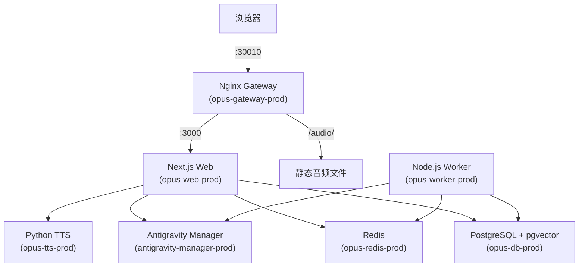

# NAS 部署指南 (Synology DSM)

> **部署目标**: Mac (ARM) → Synology NAS (AMD64)
> **部署路径**: `/volume1/docker/opus`
> **访问地址**: `http://<NAS_IP>:30010` 或自定义域名

---

## 架构总览



**7 个容器**：`gateway` / `antigravity-manager` / `opus-web` / `opus-worker` / `opus-tts` / `opus-db` / `opus-redis`

---

## 核心文件

| 文件 | 用途 |
|------|------|
| `build-and-export.sh` | 构建脚本（已加入 `.gitignore`，含密码） |
| `docker-compose.nas.yml` | NAS 专用 Compose（预构建镜像 + 绑定挂载） |
| `docker-compose.prod.yml` | 生产构建 Compose（用于 `docker compose build`） |
| `nginx/nginx.conf` | Nginx 反向代理配置 |
| `.env` | 环境变量（API Keys、数据库密码等） |

---

## 一键部署

```bash
# 首次完整构建 + 部署
./build-and-export.sh v1.0.1 --deploy

# 仅部署已有镜像（跳过构建）
./build-and-export.sh v1.0.1 --deploy-only
```

### 脚本流程

1. **设置代理** → 使用 `http://127.0.0.1:1087`
2. **构建镜像** → `DOCKER_DEFAULT_PLATFORM=linux/amd64` 跨平台编译
3. **打标签** → `opus/web:v1.0.1`、`opus/worker:v1.0.1`、`opus/tts:v1.0.1`
4. **导出 tar** → `dockers/opus-web-v1.0.1.tar`
5. **SCP 传输** → 通过 `sshpass` 密码认证传到 NAS `/tmp/`
6. **Docker Load** → `sudo docker load -i /tmp/opus-web-v1.0.1.tar`
7. **启动服务** → `docker-compose up -d`

---

## 数据持久化

使用**绑定挂载**到 NAS 固定目录，便于备份管理：

```
/volume1/docker/opus/
├── data/
│   ├── postgres/          # PostgreSQL 数据
│   ├── redis/             # Redis AOF 持久化
│   ├── audio/             # TTS 音频缓存
│   ├── logs/              # 应用日志
│   └── antigravity/       # LLM API Manager 数据
├── nginx/
│   └── nginx.conf         # Nginx 配置
├── docker-compose.yml     # 运行时 Compose（从 nas.yml 复制）
└── .env                   # 环境变量
```

---

## 数据库管理

### 初始化（首次部署）

NAS 是全新环境，需要手动初始化数据库 Schema：

```bash
# 1. 启用 pgvector 扩展
docker exec opus-db-prod psql -U postgres -d opus -c \
  'CREATE EXTENSION IF NOT EXISTS vector;'

# 2. 从本地生成 Schema SQL
npx prisma migrate diff \
  --from-empty \
  --to-schema-datamodel prisma/schema.prisma \
  --script > /tmp/schema.sql

# 3. 传到 NAS 并执行
scp /tmp/schema.sql NAS:/tmp/
docker exec opus-db-prod psql -U postgres -d opus -f /tmp/schema.sql
```

### 数据迁移（本地 → NAS）

使用 `pg_dump --column-inserts` 导出精确 SQL：

```bash
# 1. 从本地 Docker 导出指定表
docker exec opus-db pg_dump -U postgres -d opus \
  --data-only --column-inserts --disable-triggers \
  -t '"User"' -t '"Vocab"' -t '"Etymology"' -t '"SmartContent"' \
  > /tmp/data-dump.sql

# 2. 传到 NAS 并导入
scp /tmp/data-dump.sql NAS:/tmp/
docker cp /tmp/data-dump.sql opus-db-prod:/tmp/
docker exec opus-db-prod psql -U postgres -d opus -f /tmp/data-dump.sql
```

> [!CAUTION]
> **不要使用** `pg_dump --inserts`（不带 `--column`），因为本地和 NAS 的表结构列顺序可能不同，会导致数据类型不匹配。

### 数据备份

```bash
# 本地备份所有表到 JSON
npx tsx scripts/db-backup.ts
# 输出到 backups/ 目录
```

---

## 网络与域名

### Nginx 反向代理

- **容器内端口**: 80（映射到 NAS 的 30010）
- **`server_name _`**: 匹配所有域名/IP
- **`Host $http_host`**: 透传浏览器原始 Host 头

### 多域名/IP 访问

> [!IMPORTANT]
> **不要设置** `AUTH_URL` 或 `NEXTAUTH_URL` 环境变量。
> `auth.config.ts` 中的 `trustHost: true` 会自动从请求头推导 URL，支持任意域名/IP 访问。

如果通过外部反向代理（如 NAS 自带的 Nginx）转发域名流量，必须确保：
1. **正确传递 `Host` 头**（`proxy_set_header Host $http_host;`）
2. **不要设置 `X-Forwarded-Port`**（容器内端口是 80，会干扰 NextAuth）

### Server Actions Origin 检查

```js
// next.config.mjs
serverActions: {
    allowedOrigins: ["*"],  // 个人项目，允许所有来源
}
```

---

## 踩坑记录

### 1. `docker restart` 不会刷新环境变量

**现象**: 修改了 `docker-compose.yml` 或 `.env`，但 `docker restart` 后旧环境变量仍然存在。

**原因**: `docker restart` 只重启进程，不重建容器。环境变量是在容器创建时注入的。

**解决**: 必须使用 **`docker-compose up -d --force-recreate`** 重建容器。

### 2. Mac → NAS 跨平台构建

**现象**: Mac (ARM) 构建的镜像在 NAS (AMD64) 上运行报 `exec format error`。

**解决**: 构建时指定平台：
```bash
DOCKER_DEFAULT_PLATFORM=linux/amd64 docker compose build
```

### 3. SCP 传输失败 (`Connection closed`)

**现象**: `scp` 传输大文件时报 `Connection closed`。

**解决**: 使用旧版 SCP 协议：`scp -O`

### 4. Redis 权限问题

**现象**: Redis 容器启动失败 `Can't open the append-only file`。

**解决**: NAS 上创建目录后设置权限：`chmod 777 data/redis`

### 5. Prisma 7 `migrate deploy` 不可用

**现象**: 容器内 `npx prisma migrate deploy` 报 `url` 不再支持。

**原因**: Standalone 构建不包含完整 Prisma CLI，且 Prisma 7 改变了配置方式。

**解决**: 使用 `prisma migrate diff` 在本地生成 SQL，然后通过 `psql` 在 NAS 上执行。

### 6. X-Forwarded-Port 导致域名跳转

**现象**: 通过域名访问时，被重定向到 IP 地址。

**原因**: Nginx 设置了 `X-Forwarded-Port: $server_port`，容器内是 80，NextAuth 据此构造了错误的回调 URL。

**解决**: 移除 `proxy_set_header X-Forwarded-Port`，让 NextAuth 从 `Host` 头解析端口。

---

## NAS SSH 信息

| 项目 | 值 |
|------|------|
| IP | `192.168.5.23` |
| SSH 端口 | `2002` |
| 用户名 | `None` |
| 部署路径 | `/volume1/docker/opus` |
| Docker 路径 | `/usr/local/bin/docker` |
| Compose 版本 | v1 (`docker-compose`) |
