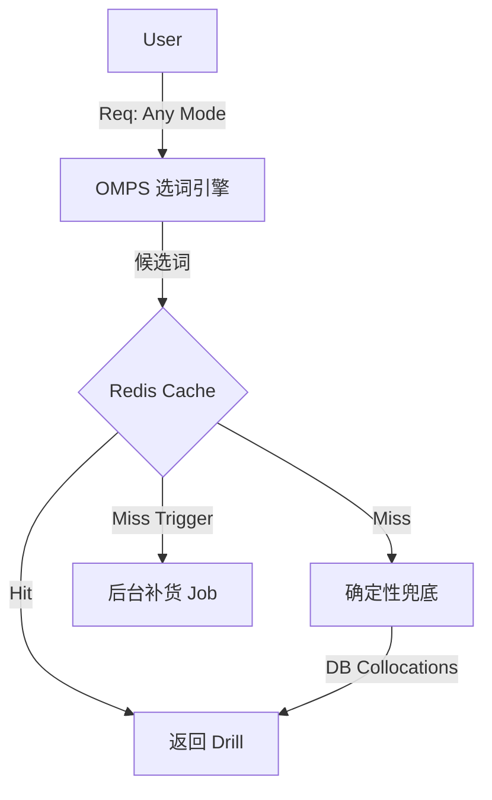

# 技术规格书：短语记忆模式 (Phrase Mode)

**版本**: 1.0  
**日期**: 2026-01-26  
**状态**: 已上线  

---

## 1. 概述 (Overview)

**Phrase Mode** 是一种高频快节奏的训练模式，旨在填补“单词”与“句子”之间的认知空白。不同于依赖 LLM 实时生成的 Syntax Mode，Phrase Mode 利用存储在 Postgres 中的静态 `collocations`（搭配词）数据，提供零延迟的 Flashcard 体验。

### 核心价值
- **语境化 (Context)**：单词在有效的短语中学习（如 "accept an *offer*"）。
- **极速 (Speed)**：无 LLM 等待时间；内容预制，秒开。
- **极简 (Simplification)**：采用 3-Button 分级 (Forgot / Hazy / Know)，降低认知负荷。

---

## 2. 架构设计：统一缓存路径 (Unified Cache-First)

> **[UPDATE] V2.0**: 原 "Fast Path" 设计已废弃，PHRASE 与其他 Mode 统一走 Redis 缓存。

### 2.1 分发逻辑 (`actions/get-next-drill.ts`)

所有 Mode 统一使用 **Cache-First + DB Fallback** 策略：



### 2.2 Worker 内的 DB-First 策略 (`drill-processor.ts`)

PHRASE 模式在 **Worker 生成阶段** 优先使用数据库搭配词：

1. 尝试从 `vocab.collocations` 构建 Drill (零 LLM 成本)
2. 若无搭配，Fallback 到 LLM 生成

### 2.3 模版引擎 (`lib/templates/phrase-drill.ts`)
- **输入**: `Vocab` 对象
- **逻辑**:
  1. 优先提取 `vocab.collocations` 中的第一个有效搭配
  2. 若无搭配，降级使用 `commonExample`
  3. 应用 Regex 将目标词包裹在 markdown bold `**word**` 中以高亮
- **输出**: 标准的多态 `BriefingPayload`。

---

## 3. 算法与评分 (Algorithms)

### 3.1 隐式评分 (`lib/algorithm/grading.ts`)
我们将用户的“作答时间”映射为 FSRS Rating，减少用户显式打分的压力。

| 耗时 (Duration) | 评级 (Rating) | FSRS 含义 | 判定逻辑 |
|---|---|---|---|
| `< 1500ms` | **4** | Easy | 瞬间反应 (肌肉记忆) |
| `1500 - 5000ms`| **3** | Good | 正常回忆时间 |
| `> 5000ms` | **2** | Hard | 犹豫 / 挣扎 |
| *点击按钮* | **1** | Again | 显式“忘记” |

* **重试上限 (Retry Cap)**：如果用户马上重试错题，最高分定为 **3 (Good)**，防止稳定性 (Stability) 虚高。

### 3.2 五维精通度 (`lib/algorithm/mastery.ts`)
Phrase Mode 专门更新雷達图中的 Context 维度：

$$ Mastery = \frac{V + C + M + A + X}{5} $$

- **V (Visual/Syntax)**: 由 Syntax Mode 更新。
- **C (Context/Phrase)**: 由 **Phrase Mode** 更新。
- **M, A, X**: 预留给未来模式。

---

## 4. UI/UX 实现

### 4.1 短语卡片 (`components/briefing/phrase-card.tsx`)
- **视觉**: 深空模式 (`bg-zinc-950`)，衬线字体 (Serif)，顶部微光 (Ambient Glow)。
- **交互**:
  1. **刺激 (Stimulus)**: 展示短语，隐藏中文翻译。
  2. **揭示 (Reveal)**: 点击任意处显示翻译与定义。
  3. **评分 (Grade)**: 底部 3 按钮 (Forgot / Hazy / Know)。

### 4.2 会话运行器 (`components/session/session-runner.tsx`)
- **状态机**: 增强以支持 PHRASE 专属的“揭示-评分”两段式交互。
- **音频**: (规划中) 集成 TTS 朗读短语。

---

## 5. 数据库 Schema

`Vocab` 表无需变更，我们复用了现有的 `JSONB` 字段 `collocations`。

```prisma
model Vocab {
  // ...
  collocations Json?  // 结构: [{text: "...", trans: "..."}]
  // ...
}
```

---

## 6. 未来优化
1. **TTS 自动播放**: 揭示答案时自动播放音频。
2. **搭配词轮播**: 目前固定取 index 0，后续应轮播不同搭配。
3. **智能降级**: 若 `collocations` 为空，实时调用 `deterministic-drill` 生成句子。
