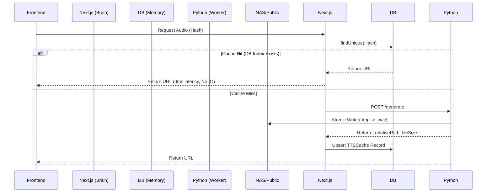

# TTS Database Index Architecture (V6.0)

## 核心理念 (Core Philosophy)
**"Next.js as Brain, Python as Hands"**

1. **Next.js (主脑)**: 负责所有业务逻辑、数据库读写、权限控制。
2. **Python (工人)**: 无状态服务，只负责 CPU 密集型任务 (TTS 生成) 和 IO (文件写入)。
3. **Database (记忆)**: `TTSCache` 表作为文件系统的索引，解决 NAS IO 瓶颈。

---

## 架构图 (Architecture)



---

## 数据模型 (Schema)

### `TTSCache`
| 字段 | 类型 | 说明 |
|------|------|------|
| `id` | String | PK, MD5 Hash (text_voice_lang_speed) |
| `cacheType` | String | GC 策略枚举: `vocab`, `phrase`, `temporary` |
| `filePath` | String | 物理存储相对路径 |
| `url` | String | 浏览器访问 URL |
| `lastUsedAt`| DateTime | 用于 LRU 清理 (Index) |

### GC 策略 (Garbage Collection)
- **Vocab/Phrase**: 永久保留 (Static Assets)
- **Temporary**: 90 天未访问自动清理 (Dynamic Assets)

---

## 关键技术点

### 1. 原子写入 (Atomic Write)
Python 端必须使用 `Atomic Write`防止并发写入导致的文件损坏：
```python
# Create temp file -> Write -> Rename (Atomic)
with open(temp_path, 'wb') as f: f.write(data)
os.replace(temp_path, target_path)
```

### 2. 浏览器长缓存 (Long-Term Caching)
由于 Hash 变更会导致 URL 变更，因此音频文件可以永久缓存：
```javascript
// next.config.mjs
headers: [
  {
    source: "/audio/:path*",
    headers: [{ key: "Cache-Control", value: "public, max-age=31536000, immutable" }]
  }
]
```

### 3. 并发控制 (Concurrency)
Next.js 使用 `prisma.upsert` 处理并发请求，忽略 `Unique Constraint` 错误，确保高并发下的稳定性。
