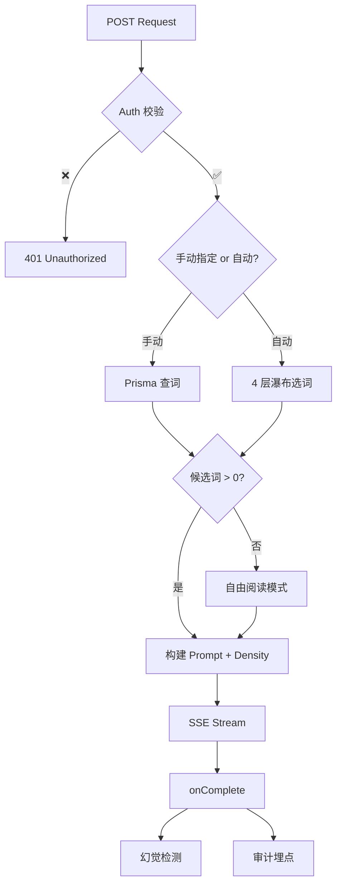

# Weaver Lab & Magic Wand - 技术架构文档

> **版本**: v2.1  
> **最后更新**: 2026-02-16  
> **状态**: ✅ 完成 (Phase 1-5 + Refactor + Code Review)

---

## 📋 概述

Weaver Lab 与 Magic Wand 是 Opus L2 Track 的核心功能模块，实现了基于 **场景优先选词** 的沉浸式商务阅读材料生成（Weaver）和即时词汇解析（Magic Wand）。

**核心价值**:
- **Scenario-First**: 6 大场景驱动选词，21 个 DB 标签映射
- **Density Control**: 三挡篇幅控制 (Light / Balanced / Dense)
- **Zero-Wait**: 流式生成 + Redis 缓存 + Force Refresh
- **AI-Native**: LLM 驱动的内容生成 + 幻觉检测
- **Fail-Safe**: 零候选词 → 自由阅读模式
- **Audit-Ready**: 全链路审计埋点 (Selection / Generation / Hallucination)

---

## 🏗️ 系统架构

### 整体架构图

```
┌──────────────────────────────────────────────────────────────────────┐
│                       Frontend (React)                              │
│  ┌────────────────────────────────────────────────────────────────┐  │
│  │              WeaverConsole (Orchestrator)                       │  │
│  │  ┌──────────────┐ ┌──────────────┐ ┌──────────────┐           │  │
│  │  │ RawMaterials │ │ContextSelector│ │DensitySelector│           │  │
│  │  │ (词汇展示)    │ │ (场景选择)    │ │ (篇幅控制)    │           │  │
│  │  └──────────────┘ └──────────────┘ └──────────────┘           │  │
│  └──────────┬─────────────────────────────────────────────────────┘  │
│             │ useSSEStream Hook                                      │
│  ┌──────────▼──────────────────────────────────────────────────┐     │
│  │  ArticleReader (SSE 流式渲染) ──► FloatingToolbar            │     │
│  │                                 ──► MagicWandSheet           │     │
│  └─────────────────────────────────────────────────────────────┘     │
└──────────────┬───────────────────────────────────────────────────────┘
               │
┌──────────────┼───────────────────────────────────────────────────────┐
│              │         Backend (Next.js)                              │
│  ┌───────────▼───────┐                ┌──────────────────┐           │
│  │  Weaver V2 API    │                │  Magic Wand API  │           │
│  │  /api/weaver/     │                │  /api/wand/word  │           │
│  │  v2/generate      │                └──────────────────┘           │
│  └───────────────────┘                                               │
│         │                                                            │
│  ┌──────▼──────────┐   ┌──────────────────────┐                     │
│  │ weaver-selection │   │ weaver-context.ts     │                     │
│  │ (4 层瀑布选词)    │   │ (Prompt + Density)    │                     │
│  └──────┬──────────┘   └──────────────────────┘                     │
│         │                     │                                      │
│  ┌──────▼──────────┐   ┌─────▼────────────────┐                     │
│  │ scenario-map.ts │   │  SSE Streaming        │                     │
│  │ (6→21 映射)      │   │  (handleOpenAIStream) │                     │
│  └─────────────────┘   └──────────────────────┘                     │
│                              │ onComplete                            │
│                       ┌──────▼──────────────────┐                    │
│                       │  幻觉检测 + 审计埋点      │                    │
│                       └─────────────────────────┘                    │
└──────────────────────────────────────────────────────────────────────┘
               │
               ▼
┌──────────────────────────────────────────────────────────────────────┐
│                Data Layer (PostgreSQL + Redis)                        │
│  • Vocab (词汇库 + scenarios 标签)                                    │
│  • UserProgress (FSRS 状态)                                          │
│  • DrillAudit (审计日志)                                              │
│  • Redis Cache (Weaver Ingredients, 30s TTL)                         │
└──────────────────────────────────────────────────────────────────────┘
```

---

## 🔌 核心模块

### 1. 智能选词引擎 (v2.1 场景优先)

#### 1.1 文件

| 文件 | 职责 |
|------|------|
| `actions/weaver-selection.ts` | Server Action — 4 层瀑布选词 |
| `lib/constants/weaver-scenario-map.ts` | 场景 → DB 标签映射 (6 → 21) |
| `lib/constants/weaver-density.ts` | Density 枚举 + UI 配置 |

#### 1.2 4 层瀑布选词策略

> **v2.0 → v2.1 变更**: 弃用 `fetchOMPSCandidates` 通用选词，改为 Prisma 直查 + 场景过滤

| 层 | 策略 | Source 标记 | 目标数 |
|----|------|-------------|:------:|
| 1 | Due 词 + 场景匹配 | `due_matched` | 10 |
| 2 | New 词 + 场景匹配 | `new_matched` | 补位 |
| 3 | Due 词 + 跨场景兜底 | `due_fallback` | 补位 |
| 4 | Filler 词 + 场景匹配 | filler | 4 |

#### 1.3 场景映射

```typescript
// lib/constants/weaver-scenario-map.ts
const WEAVER_SCENARIO_MAP = {
    finance:    ["finance", "investment", "tax_accounting"],
    hr:         ["recruitment", "personnel", "management"],
    marketing:  ["marketing", "sales", "customer_service"],
    operations: ["logistics", "manufacturing", "procurement", "quality_control"],
    office:     ["office_admin", "business_travel", "dining_events", "general_business"],
    tech:       ["technology", "negotiation", "legal", "real_estate"],
};
```

#### 1.4 缓存策略

| 参数 | v2.0 | v2.1 |
|------|------|------|
| TTL | 5 分钟 | **30 秒** |
| Key | `weaver:ingredients:{userId}:{scenario}` | + `timeWindow` 或 `manual_` prefix |
| Force Refresh | ❌ 不支持 | ✅ `forceRefresh` 参数绕过缓存 |
| Shuffle | `sort(() => Math.random() - 0.5)` | ✅ **Fisher-Yates Shuffle** |

#### 1.5 API 签名

```typescript
// actions/weaver-selection.ts
export async function getWeaverIngredients(
    userId: string,
    scenario: string,
    forceRefresh: boolean = false
): Promise<ActionState<{
    priorityWords: Array<{ id: number; word: string; meaning: string; source: string }>;
    fillerWords: Array<{ id: number; word: string; meaning: string }>;
}>>
```

---

### 2. Weaver V2 API

#### 2.1 端点

**路径**: `POST /api/weaver/v2/generate`

**输入** (Zod Schema: `WeaverV2InputSchema`):
```typescript
{
  scenario: "finance" | "hr" | "marketing" | "operations" | "office" | "tech",
  density: "light" | "balanced" | "dense",  // ✅ v2.1 新增, 默认 "balanced"
  target_word_ids?: number[]               // 可选，手动指定词汇
}
```

**输出**: SSE Stream (标准格式)

#### 2.2 核心流程



#### 2.3 幻觉检测 (v2.1 新增)

```typescript
// 检测 LLM 生成的文本中是否遗漏了目标词
const missingRate = missingWords.length / candidates.length;
if (missingRate > 0.2) {
    recordAudit({ auditTags: ['weaver_hallucination'] });
}
```

**Schema**: `HallucinationCheckSchema` (Zod)
```typescript
{ totalTargets: number, missingWords: string[], missingRate: number, isHallucinated: boolean }
```

#### 2.4 零候选词处理 (v2.1 新增)

候选词为 0 时不返回 400，进入 **自由阅读模式**：SSE 正常生成文章（无目标词高亮）。

---

### 3. Prompt 引擎

#### 3.1 文件

| 文件 | 职责 |
|------|------|
| `lib/generators/l2/weaver-context.ts` | System + User Prompt 构建 |
| `lib/validations/weaver-wand-schemas.ts` | 输入/输出 Zod Schema |

#### 3.2 System Prompt 特性

| 特性 | 描述 |
|------|------|
| 场景上下文 | 6 场景各有专属描述指令 |
| Density 控制 | `light: 120-180w` / `balanced: 200-300w` / `dense: 350-450w` |
| XML 标签 | `<target_words>` 包裹目标词表 (幻觉检测增强) |
| 输出格式 | 标题行 + 空行 + 正文，目标词 **粗体** |

#### 3.3 User Prompt 结构

```xml
场景: {scenario}

<target_words>
- negotiate (谈判)
- stakeholder (利益相关者)
</target_words>

请撰写文章，确保上述全部词汇自然嵌入文中。
```

---

### 4. Magic Wand (即时查词)

#### 4.1 API 端点

**路径**: `GET /api/wand/word`

**查询参数**: `{ word: string, context_id?: string }`

**输出** (Zod Schema: `WandWordOutputSchema`):
```typescript
{
  vocab: { phonetic: string, meaning: string },
  etymology: { mode: "ROOTS"|"DERIVATIVE"|"ASSOCIATION"|"NONE", memory_hook: string, data: object } | null,
  ai_insight: { collocation: string, nuance: string, example?: string } | null
}
```

#### 4.2 前端集成

- **触发**: 点击 `ArticleReader` 中高亮词 → `FloatingToolbar` → `MagicWandSheet`
- **分层**: Layer 1 (Local DNA, 0ms) + Layer 2 (AI Context, async)

---

### 5. SSE 流式处理

#### 5.1 后端

**核心**: `lib/streaming/sse.ts` → `handleOpenAIStream(messages, options)`

**特性**:
- ✅ 单例 OpenAI 客户端
- ✅ 标准 SSE 格式 `{type, data}`
- ✅ Try-Catch Client Disconnect 检测
- ✅ `onComplete` 回调 (幻觉检测 + 审计)

#### 5.2 前端

**核心**: `hooks/use-sse-stream.ts` → `useSSEStream(options)`

**特性**:
- ✅ AbortController 超时保护 (60s)
- ✅ RAF-buffered 帧对齐渲染 (防抖动)
- ✅ 精确依赖管理

---

### 6. 审计系统

#### 6.1 审计事件类型

| 事件 | 上下文 | 触发时机 |
|------|--------|----------|
| `WEAVER:SELECTION` | 选词决策 | Server Action 完成 |
| `WEAVER:GENERATION` | 生成开始/完成 | API 入口 / onComplete |
| `weaver_hallucination` | 幻觉检测 | 缺失率 > 20% |
| `WAND:LOOKUP` | 查词 | Wand API 调用 |

---

## 🧪 测试策略

### API 测试 (Hurl)

| 文件 | 覆盖 |
|------|------|
| `tests/l2-weaver-fsrs.hurl` | Weaver V2 API (Auth/Zod/SSE) |
| `tests/l2-magic-wand.hurl` | Magic Wand API |

### 单元测试 (Vitest)

| 文件 | 覆盖 |
|------|------|
| `actions/__tests__/weaver-selection.test.ts` | 场景选词 + Cache + 审计 |

---

## 📈 性能优化

| 层级 | 策略 | v2.1 参数 |
|------|------|-----------|
| Weaver Ingredients | Redis Cache | **30s TTL**, Force Refresh |
| Vocab Lookup | Prisma 查询优化 | N/A |
| SSE Rendering | RAF Buffer | 16ms 帧对齐 |
| Shuffle | Fisher-Yates | O(n) 均匀分布 |

---

## 📚 文件清单

### Backend

| 文件 | 类型 | 描述 |
|------|------|------|
| `actions/weaver-selection.ts` | Server Action | 4 层瀑布选词 |
| `app/api/weaver/v2/generate/route.ts` | API Route | SSE 生成 + 幻觉检测 |
| `lib/generators/l2/weaver-context.ts` | Prompt | System/User Prompt + Density |
| `lib/constants/weaver-scenario-map.ts` | Config | 6 场景 → 21 DB 标签 |
| `lib/constants/weaver-density.ts` | Config | 三挡 Density 枚举 |
| `lib/validations/weaver-wand-schemas.ts` | Schema | Zod 输入/输出校验 |
| `lib/streaming/sse.ts` | Utility | SSE 流式处理工具 |

### Frontend

| 文件 | 类型 | 描述 |
|------|------|------|
| `components/weaver/WeaverConsole.tsx` | Orchestrator | 主控组件 (状态管理 + 编排) |
| `components/weaver/console/RawMaterials.tsx` | Sub-Component | 词汇展示 (Top 3 + Dialog) |
| `components/weaver/console/ContextSelector.tsx` | Sub-Component | 场景选择卡片 |
| `components/weaver/console/DensitySelector.tsx` | Sub-Component | 篇幅控制选择器 |
| `components/weaver/ArticleReader.tsx` | Page | 流式阅读器 + 沉浸UI |
| `components/weaver/FloatingToolbar.tsx` | Widget | 文本选择工具栏 |
| `components/wand/MagicWandSheet.tsx` | Sheet | Magic Wand 底部面板 |
| `components/wand/WandContent.tsx` | Content | Wand 内容层 |
| `hooks/use-sse-stream.ts` | Hook | SSE 流式 Hook |
| `hooks/use-text-selection.ts` | Hook | 文本选择 Hook |
| `config/weaver-scenarios.ts` | Config | 场景 UI 配置 (icon/label/color) |

---

## 🐛 已知问题 & 修复历史

| 版本 | 日期 | 问题 | 修复 |
|------|------|------|------|
| v2.0 | 02-05 | SSE Controller 竞态条件 | Try-Catch 包裹 enqueue |
| v2.0 | 02-05 | useSSEStream 依赖问题 | 解构 options 避免闭包 |
| v2.1 | 02-15 | Shuffle 偏差 (Math.random-0.5) | Fisher-Yates Shuffle |
| v2.1 | 02-15 | 缓存 5 分钟过旧 | 30s TTL + Force Refresh |
| v2.1 | 02-15 | OMPS 选词无场景感知 | 4 层瀑布 + 场景映射 |
| v2.1 | 02-15 | console.log 泄漏 | 替换为 `createLogger` |
| v2.1 | 02-16 | WeaverConsole 过于臃肿 | 拆分为 3 个子组件 |

---

**维护者**: Hugo (Opus Team)  
**最后审计**: 2026-02-16 (v2.1 Feature Complete)
